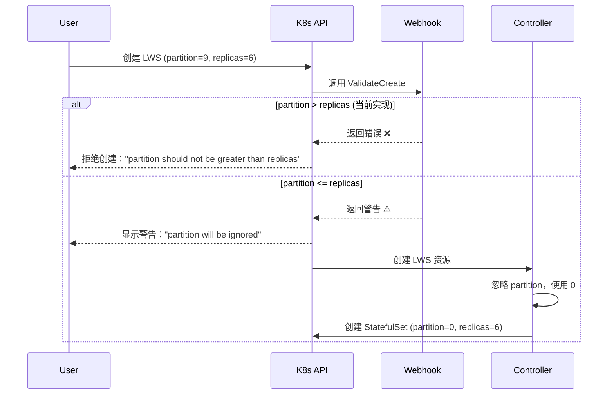

# Webhook 验证流程详解

## 1. Webhook 返回值的含义

### Warnings vs Errors

| 类型 | 作用 | 结果 | 用户体验 |
|------|------|------|----------|
| **Warnings** | 提示信息 | ✅ 资源**会被创建** | 用户看到警告，但操作成功 |
| **Errors** | 验证失败 | ❌ 资源**不会被创建** | 用户看到错误，操作失败 |

## 2. 实际执行流程

### 场景 1：用户创建 partition=9, replicas=6 的 LWS

```yaml
# 用户提交的 YAML
apiVersion: leaderworkerset.x-k8s.io/v1
kind: LeaderWorkerSet
metadata:
  name: test-lws
spec:
  replicas: 6
  rolloutStrategy:
    rollingUpdateConfiguration:
      partition: 9  # 问题配置
      maxSurge: 3
```

#### Step 1: Webhook 验证

```go
func ValidateCreate() {
    // 1. 检查 partition > 0
    if partition > 0 {
        warnings = ["partition value 9 will be ignored..."]  // ⚠️ 警告
    }
    
    // 2. 通用验证
    allErrs = generalValidate()
    // 检查 partition > replicas
    if partition > replicas {
        allErrs = ["partition (9) should not be greater than replicas (6)..."]  // ❌ 错误
    }
    
    return warnings, allErrs  // 返回警告和错误
}
```

#### Step 2: Kubernetes 处理 Webhook 响应

```
如果 error != nil:
    拒绝创建 → 用户收到错误信息
    
如果 error == nil:
    允许创建 → 显示警告（如果有）→ 资源被创建
```

### 场景 2：实际会发生什么？

当前代码中，`partition > replicas` 被当作**错误**处理：

```go
// 在 generalValidate 中
if *partition > *lws.Spec.Replicas {
    allErrs = append(allErrs, field.Invalid(...))  // 这是错误，不是警告！
}
```

**结果**：资源创建会被**拒绝**！

## 3. 控制器的行为

即使 Webhook 允许创建（只有警告），控制器也会忽略 partition：

```go
// 在 rollingUpdateParameters 函数中
defer func() {
    // 初始部署时忽略用户的 partition 设置
    if sts != nil && *sts.Spec.Replicas > 0 {
        stsPartition = max(stsPartition, *partition)
    }
    // 如果 sts == nil 或 replicas == 0，partition 保持为 0
}()
```

## 4. 完整的执行时序



## 5. 当前实现的问题

### 问题 1：partition > replicas 被当作错误

```go
// 当前代码
if *partition > *lws.Spec.Replicas {
    allErrs = append(allErrs, field.Invalid(...))  // ❌ 这会拒绝创建
}
```

**影响**：用户无法创建 partition=9, replicas=6 的 LWS

### 问题 2：混淆的消息

- ValidateCreate 说"will be ignored"（会被忽略）
- generalValidate 说"should not be greater"（不应该大于）
- 一个是警告，一个是错误

## 6. 建议的修复方案

### 选项 A：将 partition > replicas 改为警告（推荐）

```go
func generalValidate() {
    // 只对负数报错
    if *partition < 0 {
        allErrs = append(allErrs, field.Invalid(...))  // 错误：拒绝创建
    }
    // partition > replicas 不再作为错误，只在 ValidateCreate 中警告
}
```

### 选项 B：保持错误，但修改消息

```go
func ValidateCreate() {
    // 不要说"will be ignored"，因为实际上会被拒绝
    if partition > replicas {
        // 不返回警告，让 generalValidate 的错误处理
    }
}
```

## 7. 实际测试验证

### 测试当前行为

```bash
# 创建一个 partition > replicas 的 LWS
cat <<EOF | kubectl apply -f -
apiVersion: leaderworkerset.x-k8s.io/v1
kind: LeaderWorkerSet
metadata:
  name: test-partition
spec:
  replicas: 6
  rolloutStrategy:
    rollingUpdateConfiguration:
      partition: 9
      maxSurge: 3
  leaderWorkerTemplate:
    size: 2
    workerTemplate:
      spec:
        containers:
        - name: nginx
          image: nginx
EOF
```

**预期结果（当前代码）**：
```
error validating data: ValidationError(LeaderWorkerSet.spec.rolloutStrategy.rollingUpdateConfiguration.partition): 
invalid: partition (9) should not be greater than replicas (6), as it will not update any Pods
```

### 测试修复后的行为

如果将 partition > replicas 改为警告：
```
Warning: partition value 9 will be ignored during initial deployment. All 6 replicas will be created.
leaderworkerset.leaderworkerset.x-k8s.io/test-partition created
```

## 8. 总结

### 当前实现
- **Webhook**：partition > replicas → **错误** → **拒绝创建**
- **Controller**：如果能创建，会忽略 partition

### 关键理解
1. **Warnings** = 允许操作，但提示用户
2. **Errors** = 拒绝操作
3. **Controller** 只有在资源被创建后才能执行

### 用户体验
- 当前：用户**无法**创建 partition=9, replicas=6 的 LWS
- 建议：允许创建，但警告用户 partition 会被忽略